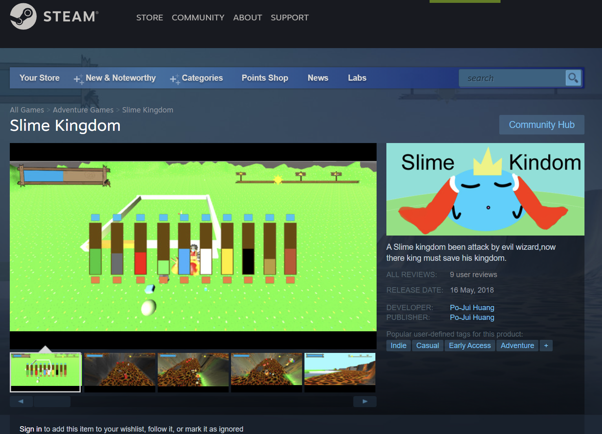

# Undergraduate_unity_design
This is a Unity PC game made by undergraduate students in NCUE Taiwan

Creater: Vincent Huang, Paul Lu, H.Y. Chen, Z.Y. Huang.

Developed platform: Unity, Maya
Launched platform: Steam.

Intro Video: Youtube ["Slime Kingdom - Intro"](https://www.youtube.com/watch?v=oB9Jehshzfo)

[Steam page](https://store.steampowered.com/app/866960/Slime_Kingdom/)

We really like to play computer games, so we decided to challenge ourselves to make a game.
We knew how difficult it was, but we did not escape.

To finished this project, we took Unity course, Maya course, and app develope course.

We did meet some obstacles, we did struggle in lacking of idea, we did confused, and we did have some argument during the project.

But all that made this game has **the best** as we could at that time.
